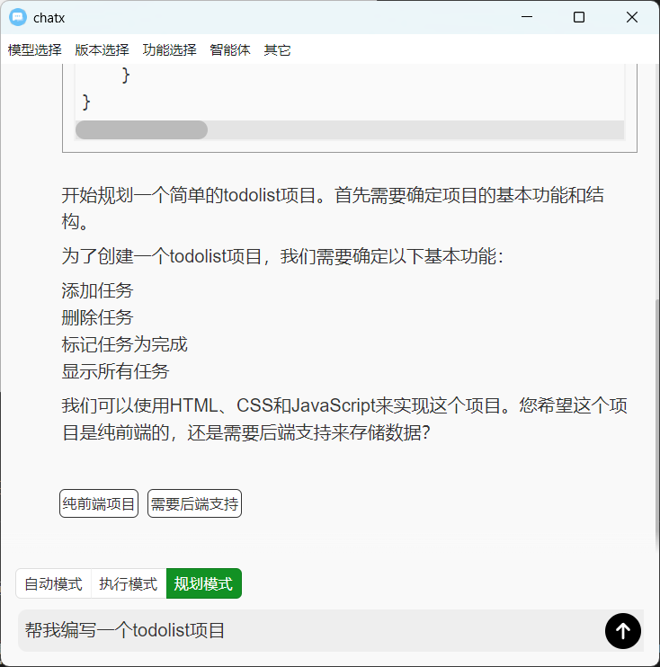
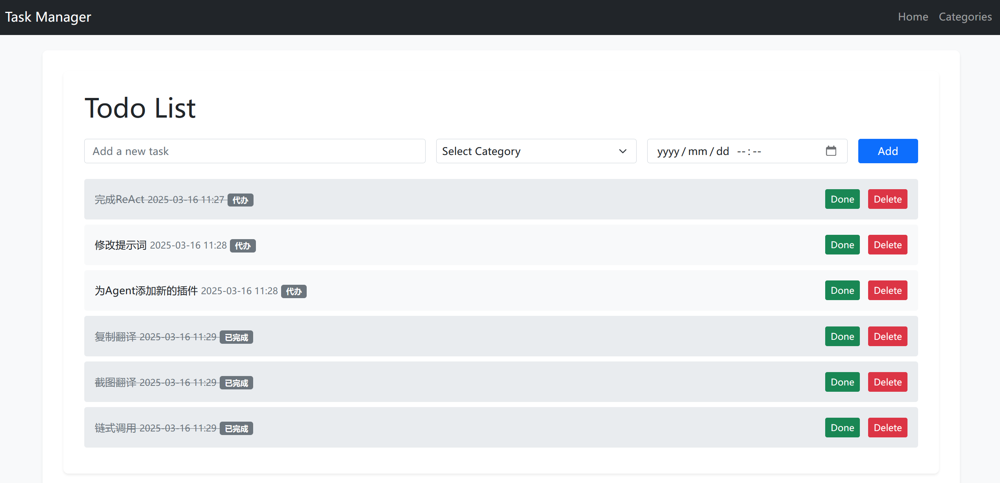
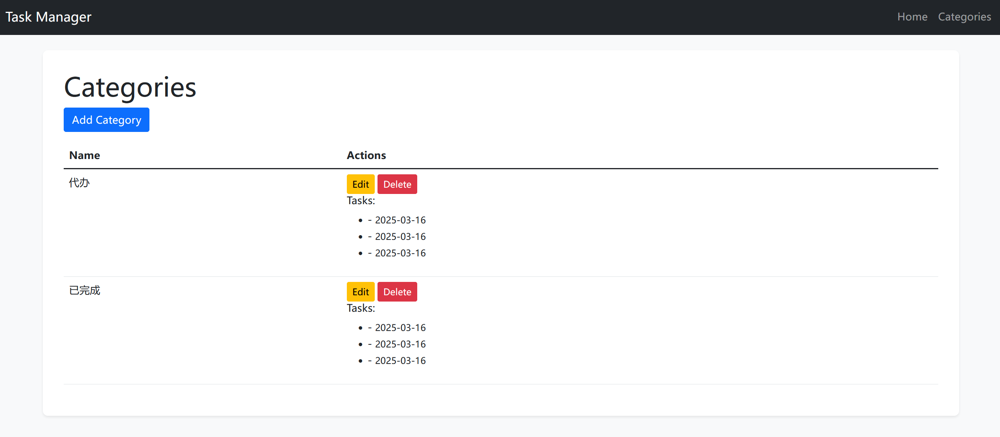

# BixChat



BixChat 是一款功能强大的跨平台转录调Agent应用程序，支持 Windows 和 Linux 系统。通过ReAct架构，即思考、行动和观察，能够帮助使用研究人员完成复杂的转录调控分析任务。于此同时，w我们提供了多种方式便于用户快速集成新的工具，其中包括了MCP服务和自定义工具工具，因此，BixChat是一个通用的架构，能够在根据研究人员的需求进行定制化的配置。

## 特色功能

### Ollama支持


- 为了进一步提供数据分析的隐私保护需求，我们集成Ollama功能，支持接入用户本地部署的私有大模型。

### 自定义工具

- 为了便于为本软件设计更多系统级别功能，我们允许用户自定义工具，其中包括工具的调用和工具的提示。

### MCP服务

- 模型上下文协议（MPC）是一个便于用户快速接入开源工具的方式，本软件支持通过简单通用配置文件的方式快速接入MCP服务。

### biotools

- 我们提供了一个通用的转录调控MCP服务名为“biotools”，用户可以使用多种工具快速接入。

### 虚拟化环境

- 为了防止Agent执行系统级别命令对本地环境造成破坏，我们使用的Docker虚拟化技术，所有执行的结果都将保存在用户指定的目录。与此同时，这也使得我们的工具可以在多个平台上快速迁移。

### ReAct

- 我们使用ReAct，这使得我们的软件能帮助用户自动完成文件分析，代码修改，网络搜索等等。

### 系统提示词
- 我们预留了系统提示词的注入接口，通过简单的修改配置文件，可以方便研究人员个性化的微调智能体行为

### 记忆
- 我们进一步优化了记忆模块，在面对超长上下文任务中，我们采用了长期记忆加短期记忆结合的方式。短期记忆即智能体保留几个对话周期的消息，而长期记忆即智能体保留10倍与短期记忆的用户消息和智能体思考内容。而对于智能体需要回忆的内容，我们提供了“记忆回溯”工具，能够让智能体进一步具有回忆的能力。

### 其它功能
- 为了满足研究人员一站式需求，我们在软件中也集成了基础对话，链式调用，对话保存与加载等功能。

## 案例

### 下面是 Agent 实现 PDF 文件文字自动化提取，通过调用视觉大模型来实现 OCR。




### 下面是 Agent 实现 PDF 文件文字自动化提取，通过调用视觉大模型来实现 OCR。


## 系统要求

- **Windows**：Windows 10 或更高版本。
- **Ubuntu**：Ubuntu 18.04 或更高版本。

---

## 启动 / 编译

```shell
nvm use 23
# 安装环境
npm install
# 启动electron
npm run electron-start
# 打包
npm run package
# or
npm run make
```

_- 由于版本快速迭代，建议自己编译以体验最新功能. -_

## 若安装失败请手动复制配置文件(resource/config.json)到如下地址:

- linux: /home/[用户]/.bixchat/config.json
- windown: C:\Users\\[用户]\\.bixchat\config.json

## 安装完成后需进行以下操作

> Agent参数配置

config.json

```json
"tool_call": {
  "memory_length": 20,
  "mcp_timeout": 600,
  "extra_prompt": "/你的系统提示词路径/prompt.md",
  "llm_parmas": {
    "max_tokens": 8000,
    "temperature": 0.5,
    "stream": true,
    "response_format": {
      "type": "json_object"
    }
  }
}
```

> Agent工具配置

config.json

```json
"python_execute": {
  "params": {
    "python_bin": "python",
    "delay_time": 10,
    "threshold": 10000
  },
  "enabled": true
}
```

_- 更多案例见： -_

[resource/plugins](resource/plugins)


> Agent工具配置

config.json

```json
"python_execute": {
  "params": {
    "python_bin": "python",
    "delay_time": 10,
    "threshold": 10000
  },
  "enabled": true
}
```

> 安装工具依赖

[工具页面: resource/plugins](resource/plugins)

> 配置大模型示例 (`ollama支持`)

config.json

```json
"models": {
  "ollama": {
    "api_url": "http://localhost:11434/api/chat",
    "versions": [
      "llama3.2",
      {
        "version": "gemma3:12b",
        "vision": [
          "image"
        ],
        "ollama": true
      }
    ]
  },
  "deepseek": {
    "api_url": "https://api.deepseek.com/chat/completions",
    "api_key": "你的key",
    "versions": [
      "deepseek-coder",
      "deepseek-chat",
      "deepseek-reasoner"
    ]
  },
  "chatglm": {
    "api_url": "https://open.bigmodel.cn/api/paas/v4/chat/completions",
    "api_key": "你的key",
    "versions": [
      "glm-4-flash",
      "glm-4-long",
      {
        "version": "glm-4v-flash",
        "vision": [
          "image"
        ]
      }
    ]
  },
}
```

> 配置大模型请求参数示例

config.json

```json
"llm_parmas": {
  "max_tokens": 4000,
  "temperature": 1.5,
  "stream": true
}
```

> 配置信息框模版示例

config.json

````json
"info_template": "阶段: {step}, 调用: {model}, 版本: {version}, 输出: \n\n```\n{output_format}\n```\n\n",
````

_- 可用配置字段如下: -_

- step: 当前阶段号
- model: 当前使用模型(model/plugins)
- version: 当前使用模型版本
- query: 初始输入
- input: 当前阶段格式化输入
- img_url: 初始图片 base64 输入
- output: 当前阶段原始输出
- outputs: 历史原始输出
- output_format: 当前阶段格式化输出
- output_formats: 历史格式化输出
- prompt: 初始系统提示词
- prompt_format: 当前阶段格式化系统提示词
- llm_parmas: 大模型请求参数
- api_url: 大模型请求 URL
- api_key: 大模型请求 KEY

_- 格式化：细节见链式调用 -_

> 配置记忆长度示例

config.json

```json
"memory_length": 10
```

> 配置失败重试次数示例

config.json

```json
"retry_time": 10
```

> 配置悬浮框快捷键显示时长示例

config.json

```json
"icon_time": 5
```

> 配置悬浮框快捷键示例

config.json

```json
"short_cut": "CommandOrControl+Shift+Space"
```

> 配置功能默认状态示例

config.json

```json
"func_status": {
  "clip": true,
  "react": true,
  "markdown": true,
  "math": true,
  "text": false
}
```

> 配置默认项示例

config.json

```json
"default": {
  "model": "deepseek",
  "version": "deepseek-chat",
  "plugin": "baidu_translate"
}
```

> 配置链式调用示例

参数周期:

* input_*: 使用调用模型前`可配置字段值`进行格式化
* ouput_*: 使用调用模型后`可配置字段值`进行格式化

config.json

- 基础对话

```json
"chain_call": [
  {
    "end": true
  }
]
```

- 基础对话+图片识别

```json
"chain_call": [
  {
    "input_template": "{img_url?'请识别图像内容后回答。':''}{input}",
    "end": true
  }
]
```

- 强制思维链

```json
"chain_call": [
  {
    "prompt_template": "{prompt}\nA conversation between User and Assistant.\nThe user asks a question, and the Assistant solves it.\nThe assistant first thinks about the reasoning process in the mind and then provides the user with the answer.\nThe assistant should engage in a lengthy period of contemplation before answering a question, while also reflecting on whether there are any errors in their thought process. \nDuring the thinking process, the assistant should propose multiple solutions and provide an extended chain of thought for each one.\nThe thought process for each solution should be very detailed, including the specific steps for implementation.\nThe reasoning process is enclosed within <think> </think> and <answer> </answer> tags, respectively, i.e:\n<think>\n reasoning process here \n</think>\n<answer>\n answer here \n</answer>",
    "input_template": "{input}",
    "end": true
  }
]
```

- 思维链拼接

```json
"chain_call": [
  {
    "model": "together",
    "version": "deepseek-ai/DeepSeek-R1-Distill-Llama-70B-free",
    "prompt": "请思考后回答"
  },
  {
    "model": "plugins",
    "version": "提取思维链",
    "input_data": {
      "input": "{input}"
    },
    "output_template": "<think>{output}</think>\n- query:{query}\n- answer:"
  },
  {
    "end": true
  }
]
```

- 文件对话

```json
"chain_call": [
  {
    "model": "plugins",
    "version": "文件读取",
    "input_data": {
      "file_path": "{file_path}"
    }
  },
  {
    "input_template": "如下是pdf中的文字内容:\n\n<pdf>{output_formats[0]}</pdf>\n\n如下是user输入内容:\n\n<user>{query}</user>\n\n请根据pdf中内容回答user输入。回复要求如下：\n- 过滤多余的文字，例如行号、页码和水印等。 \n- 尽可能多的思考细节、潜在相关和可能相关的内容。 \n- 对于原文中没有的内容，不需要猜测，提出观点和输出和原文可能产生不一致的内容。\n- 按照规范的格式输出。",
    "end": true
  }
]
```

_- 可配置字段 -_

该配置参数默认为原始字段属性值(见配置信息框模版)

特有字段：

- input_template: 当前阶段输入格式化模版
- output_template: 当前阶段输出格式化模版
- prompt_template: 系统提示格式化模版
- end: 链式调用结束标志

_- 可配置显示组件 -_

- system-prompt: 系统提示输入框
  - 对应可用字段为:
    - prompt: 初始系统提示词
- file-reader: 文件读取按钮
  - 对应可用字段为:
    - file-reader: 读取文件的路径

_- 更多案例见： -_

[resource/chain_calls](resource/chain_calls)

## 具体咨询请联系：

qq: 1084337496
邮箱: 1084337496@qq.com
